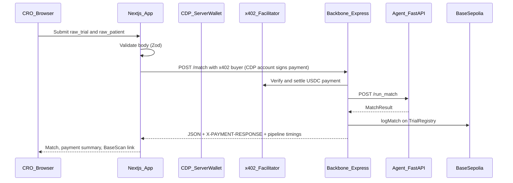

# Optional: x402 / USDC billing (advanced)

TrialBridge can run in two **payment modes**:

| Mode | Backbone | Next.js |
|------|----------|---------|
| `standard` (default) | No `x402-express` middleware on `POST /match` or `POST /batch_match_parsed` | `NEXT_PUBLIC_PAYMENT_MODE=standard` — no CDP payer, no payment UI |
| `x402` | HTTP 402 + USDC settlement via facilitator | `NEXT_PUBLIC_PAYMENT_MODE=x402` — CDP Server Wallet signs `X-PAYMENT` |

Enterprise / CRO-facing deployments should use **`standard`** unless you explicitly want pay-per-call USDC.

---

## x402 — business model (technical)

**x402** is an HTTP-native payment protocol. A server can return `HTTP 402 Payment Required` with a USDC amount and receiver. The client pays and retries. No subscriptions required at the protocol level.

### Who pays whom

```
PAYER:  Pharma company / CRO / researcher  ──────► pays USDC per match request
                                                     via x402 HTTP 402 response
RECEIVER: Your TrialBridge API endpoint (PAY_TO_ADDRESS)
AMOUNT:  $0.10 per single match (POST /match), $2.00 per batch rank (POST /batch_match_parsed)

PATIENT: Does NOT receive direct payment in MVP.
```

### Why it fits an API product

- Matching is literally an HTTP API — x402 targets API monetization.
- Trial sponsors already pay per lead to CROs; this automates collection.
- Both x402 settlement and optional `TrialRegistry` audit logging in this repo target **Base Sepolia** (testnet) unless you reconfigure for Base mainnet.

---

## Diagram — dashboard + backbone (x402 mode)

```
 CRO User (Browser)
       │
       ▼
 Next.js Frontend (:3000)
  ├── /match            → Single JSON match + batch CSV rank UI
  ├── /api/match        → x402 POST /match ($0.10) → agents
  ├── /api/ingest_csv   → agents /ingest_patients_csv (no x402 on agents)
  ├── /api/batch_match  → x402 POST /batch_match_parsed ($2) → agents
  │    └── Payment receipt: tx hash + BaseScan link when settled
  │
  └── /funding          → CDP payer + Onramp (x402 mode UI)
       │
       ▼
 Backbone Express (:4020)
  ├── x402 middleware validates payment (per route amount)
  ├── POST /match → Agent /run_match + logMatch() on registry
  ├── POST /batch_match_parsed → Agent /batch_match_parsed (ranked list; no per-row logMatch)
  └── Returns JSON + pipeline timings + X-PAYMENT-RESPONSE
```

---

## Frontend signing flow (x402 mode only)

Server route handlers (`app/api/match`, `app/api/batch_match`) use `x402Fetch` from [`frontend/lib/cdp-wallet.ts`](../frontend/lib/cdp-wallet.ts): first POST may return **402**; the client builds `X-PAYMENT` via CDP Server Wallet (EIP-3009 USDC on Base Sepolia), retries, then returns JSON. [`frontend/lib/x402-settlement.ts`](../frontend/lib/x402-settlement.ts) decodes `X-PAYMENT-RESPONSE` for the UI.

**Rough sequence:**



Coinbase Onramp, gas on Base Sepolia for `logMatch`, and per-tenant CDP accounts are described in historical frontend docs; keep CDP secrets server-side only (`NEXT_PUBLIC_*` must never expose keys).

---

## Environment (x402 mode)

**Backbone** (`medullAI/backbone/.env`):

- `PAYMENT_MODE=x402`
- `PAY_TO_ADDRESS` — receives USDC
- `FACILITATOR_URL` — default `https://facilitator.xpay.sh`

**Frontend** (`medullAI/frontend/.env.local`):

- `NEXT_PUBLIC_PAYMENT_MODE=x402`
- `CDP_API_KEY_ID`, `CDP_API_KEY_SECRET`, `CDP_WALLET_SECRET`, `CDP_PROJECT_ID`
- `BACKBONE_URL` pointing at the backbone

---

## On-chain audit (separate from payment)

`POST /match` and `POST /match_parsed` call `TrialRegistry.logMatch` on **Base Sepolia** via viem. This is independent of `PAYMENT_MODE`.

- Explorer: https://sepolia.basescan.org  
- Example deployment: `0x40cAD144A2Dc503FdFFcbc84aBBeb0007924fc08`

---

## References

- x402 overview: https://x402.org  
- npm: `x402-express`  
- DeepSeek API: https://platform.deepseek.com  
- CDP Server Wallets: https://docs.cdp.coinbase.com/server-wallets/v2/introduction/welcome  

---

## India (DPDP Act 2023 + Rules 2025)

- India uses a **negative list** model for cross-border transfers unless a country is restricted by the Central Government.
- **Health data** is sensitive; explicit consent may be required for transfer.
- **CTRI trial data** used in this project is public listing data.
- **AIKosh datasets** — typically downloaded locally for training/testing; avoid live PII export without legal review.
