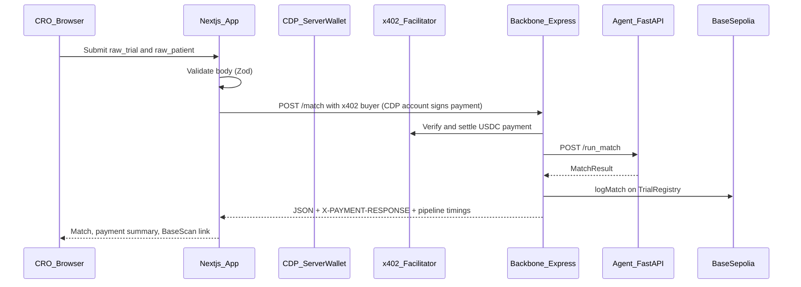

# TrialBridge — Decentralized B2B dashboard

This is the **CRO / pharma-facing interface** for TrialBridge: submit trial + patient JSON, see **x402 payment**, **agent pipeline**, and **on-chain audit** links—without exposing CDP keys or wallet secrets in the browser.

---

## Architecture workflow




**Core principle:** CDP credentials and the **payer wallet** live only in **Next.js Route Handlers** (`app/api/*`). The client never receives private keys or API secrets.

---

## Why not MetaMask or WalletConnect Instead of CDP Server wallet?

- TrialBridge targets **B2B CRO / pharma operators**, not retail DeFi users. Expecting every org to install **MetaMask**, manage seed phrases, or connect via **WalletConnect** in a procurement-heavy workflow creates friction and poor fit for enterprise dashboards. 

- Here the **primary path** is: sign into your product (or internal demo), run a match, and let a **server-side CDP Server Wallet** pay **x402** in **USDC**—no browser extension, no shared custody of keys in the frontend. 

> MetaMask / WalletConnect remain optional **“advanced / bring your own wallet”** patterns if you later expose them; they are not required for the core story.

---

## Coinbase Onramp, gas, and Base (Sepolia → mainnet)

| Piece | What it is in this stack |
|-------|----------------------------|
| **Coinbase Onramp** | **Fiat → USDC** into the **org payer address** on **Base Sepolia** (hosted checkout; session minted on the **server** in `POST /api/onramp/session`). It is a **funding rail** so the CDP payer can cover **$0.10 USDC per match** via x402—not a replacement for chain configuration elsewhere. |
| **x402 payment** | Paid in **USDC** (EIP-3009 style flow through the x402 facilitator on **Base Sepolia**). This is separate from ETH **gas** for unrelated txs. |
| **Registry writes (`logMatch`)** | Executed by the **backbone** deployer wallet (see `medullAI/backbone/.env`); that wallet pays **ETH gas** on Base Sepolia today. |


> **Gas sponsorship (roadmap, not fully wired in this repo):** For **gasless** or **sponsored** execution for org-owned flows on Base, the intended direction is **CDP Smart Accounts (ERC-4337) + Paymaster** so user operations can be paid or sponsored according to policy—same pattern on **Base Sepolia** first, then **Base mainnet** (swap network IDs, USDC addresses, and facilitator settings). 

Coinbase documents Paymaster / bundler usage with CDP; you typically use a **project-scoped** RPC / Paymaster URL from the [CDP Portal](https://portal.cdp.coinbase.com/) (example Base Sepolia node: `https://api.developer.coinbase.com/rpc/v1/base-sepolia/<your-project-path>` — replace with your own endpoint; do not commit secrets). **Onramp does not “sponsor gas” by itself**; it tops up **USDC**. Sponsored gas is a **separate** integration (Paymaster / AA) when you move `logMatch` or org transactions behind smart accounts.

---

## Pay per org on Base mainnet (aim)

**Today (v1):** One set of **CDP API credentials + `CDP_WALLET_SECRET`** in env and one **named payer account** (`TrialBridgePayer`) for all dashboard users.

**Target (production):**

1. **Per org (pharma / CRO)**:  **one CDP project** with **per-tenant** metadata and **separate EVM accounts** via `getOrCreateAccount({ name: orgId })` so usage and balances are isolated.
2. **Billing:** Meter **$0.10 / match** (x402) against that org’s payer USDC balance; optional **prepaid top-up** via Onramp to the org’s payer address.
3. **Base mainnet:** Point **network** to **Base** (`eip155:8453` / `base` in product configs), use **mainnet USDC** and **mainnet** `PAY_TO` / facilitator settings on the **seller** side, and fund the org payer with mainnet USDC. Keep **testnet** and **mainnet** envs split (e.g. `BACKBONE_URL`, CDP project, payer account names).

---

## Core decisions

| Decision | Rationale |
|----------|-------------|
| **Single org CDP Server Wallet (env)** | One named EVM account (`TrialBridgePayer` via `getOrCreateAccount`) pays x402 for all dashboard users in v1—fast to ship and demo; multi-tenant wallets are a later step. |
| **x402 buyer on the server** | Uses `x402`’s `createPaymentHeader` with the CDP EVM account (EIP-3009 USDC on Base Sepolia). First `POST /match` may return **402**; the server builds `X-PAYMENT`, retries, then returns the match JSON. |
| **Facilitator alignment** | Backbone (`x402-express`) and the public x402 stack use the same facilitator semantics as the buyer client; network is **`base-sepolia`**. If you change facilitator URLs on the seller, update buyer/seller together. |
| **Onramp behind optional secret** | `POST /api/onramp/session` can require `MATCH_API_SECRET` (header `x-api-secret`) so session tokens are not minted anonymously—per [Onramp security requirements](https://docs.cdp.coinbase.com/onramp/security-requirements). |
| **Hard-filter copy in the UI** | Agents run **parse trial + parse patient before** `score_match`. When `hard_filter_passed === false`, the UI describes **skipping eligibility scoring LLM**, not “saved all LLM cost”—parsers may still have run. |

---

## Features and integrations

| Area | What it does |
|------|----------------|
| **`/match`** | JSON editors for CTRI-shaped trial + AIKosh-shaped patient; calls **`POST /api/match`**; shows animated pipeline phases and results (score, rationale, disqualifiers, BaseScan). |
| **`/activity`** | Proxied backbone health (`/api/health`) and optional direct reads to backbone **`/match_count`** and **`/matches/:index`** (set `NEXT_PUBLIC_BACKBONE_URL` if the browser cannot reach `127.0.0.1:4020`). |
| **`/funding`** | Read-only payer address + Base Sepolia **USDC** contract info; Coinbase Onramp button (session from server); manual transfer / faucet copy for regions where Onramp is limited. |
| **`lib/cdp-wallet.ts`** | `CdpClient`, `getOrCreateAccount`, **`x402Fetch`** (402 → sign → retry). |
| **`app/api/match/route.ts`** | Zod validation → `x402Fetch(BACKBONE_URL/match)` → attach sanitized **`payment`** block for the UI. |
| **`app/api/onramp/session/route.ts`** | `GET`: payer + USDC contract on Base Sepolia (for funding the **payer**, not `TrialRegistry`). `POST`: JWT to CDP → hosted onramp URL (optional auth). |
| **`next.config.ts`** | CORS for API routes via `ALLOWED_ORIGIN`; `serverExternalPackages` includes `@coinbase/cdp-sdk`. |

**Packages:** `@coinbase/cdp-sdk`, `x402`, `viem`, `zod` (see `package.json`).

---

## Environment variables

Copy **`.env.example`** to `.env.local` and fill values.

**CDP (server-only — never prefix with `NEXT_PUBLIC_`):**

- `CDP_API_KEY_ID`, `CDP_API_KEY_SECRET`, `CDP_WALLET_SECRET`, `CDP_PROJECT_ID`

**Integration:**

- `BACKBONE_URL` — Express backbone base URL (default `http://127.0.0.1:4020`).
- `MATCH_API_SECRET` — Optional; if set, required for `POST /api/onramp/session` as header `x-api-secret`.
- `ALLOWED_ORIGIN` — CORS origin for `/api/match` and `/api/onramp/*` (default `http://localhost:3000`).
- `NEXT_PUBLIC_BACKBONE_URL` — Optional; Activity page calls backbone from the **browser** for on-chain listing; must be reachable from the user’s machine.

`TrialRegistry` and the backbone **`PRIVATE_KEY`** / **`PAY_TO_ADDRESS`** live in **`medullAI/backbone/.env`**, not here—the Next app only talks to the backbone over HTTP.

---

## Local development

1. **Agents** (port `8100`) and **backbone** (port `4020`) must be running with valid `.env` files.
2. Fund the **CDP payer** with Base Sepolia **USDC** (each match costs **$0.10** via x402).
3. Start the dashboard:

```bash
npm install
npm run dev
```

Open [http://localhost:3000](http://localhost:3000) (redirects to `/match`).

```bash
npm run build
```

---

## Official references

- [x402 overview](https://docs.cdp.coinbase.com/x402/welcome)
- [Server Wallet v2](https://docs.cdp.coinbase.com/server-wallets/v2/introduction/welcome)
- [Coinbase-hosted Onramp](https://docs.cdp.coinbase.com/onramp/coinbase-hosted-onramp/overview)
- [Onramp security](https://docs.cdp.coinbase.com/onramp/security-requirements)

