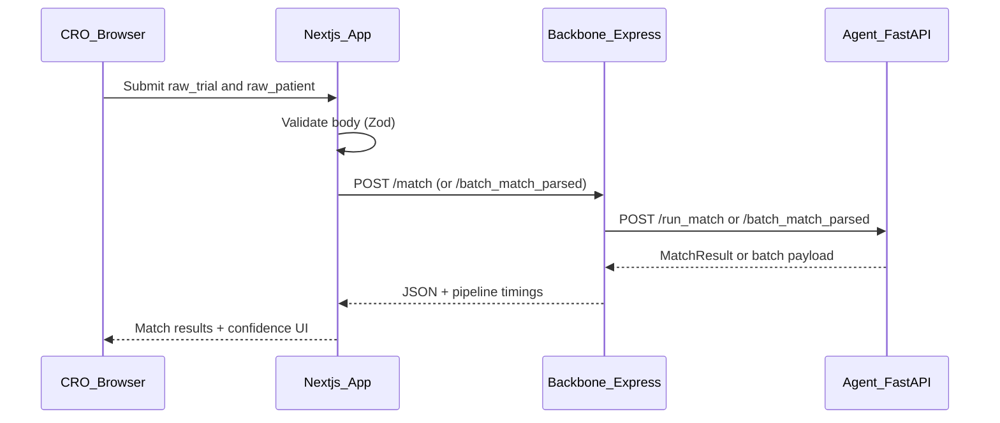

# TrialBridge — CRO / pharma dashboard

CRO / pharma-facing dashboard for TrialBridge: submit trial + patient JSON, run batch rank over CSV, and see the **agent pipeline**, **confidence scoring**, and **EDC ingestion** — without exposing secrets in the browser.

---

## Architecture workflow



**Batch rank (`/match` tab):** upload patient CSV → `POST /api/ingest_csv` (agents) → pick trial JSON → `POST /api/batch_match` → backbone `POST /batch_match_parsed`. Response includes **`pipeline`** timings.

**Core principle:** integration secrets for third-party services belong only in **Next.js Route Handlers** (`app/api/*`). The browser never receives private keys or server-only API secrets.

---

## Features and integrations

| Area | What it does |
|------|----------------|
| **`/match`** | Single: JSON editors → **`POST /api/match`**. Batch: CSV upload → **`POST /api/ingest_csv`** → ranked table via **`POST /api/batch_match`**. Pipeline timings, rationale toggle, Phase II-III confidence UI. |
| **`/activity`** | Proxied backbone health (`/api/health`). Optional on-chain widgets when payment mode exposes them — see [X402_PAYMENTS.md](../backbone/X402_PAYMENTS.md). |
| **`/funding`** | Only when **`NEXT_PUBLIC_PAYMENT_MODE=x402`** (USDC / CDP funding UI). |
| **`lib/types.ts`** | `MatchResult`, `BatchMatchStats` with Phase II-III fields |
| **`app/api/match/route.ts`** | Zod → backbone `/match` |
| **`app/api/ingest_csv/route.ts`** | Proxies multipart CSV to agents **`/ingest_patients_csv`**. |
| **`app/api/batch_match/route.ts`** | Normalises CTRI corpus JSON to **`TrialCriteria`** → backbone **`/batch_match_parsed`**. |
| **`next.config.ts`** | CORS for `/api/*` via `ALLOWED_ORIGIN`; `serverExternalPackages` includes `@coinbase/cdp-sdk` when used. |

Payment-mode-only modules (`lib/cdp-wallet.ts`, `lib/x402-settlement.ts`, `X402PaymentReceipt`, `/api/onramp/*`) are documented in [medullAI/backbone/X402_PAYMENTS.md](../backbone/X402_PAYMENTS.md).

**Packages:** `@coinbase/cdp-sdk`, `x402`, `viem`, `zod` (see `package.json`) — CDP/x402 used only when `NEXT_PUBLIC_PAYMENT_MODE=x402`.

---

## Environment variables

Copy **`.env.example`** to `.env.local` and fill values.

**Default (standard mode):**

- `NEXT_PUBLIC_PAYMENT_MODE=standard` — CRO-safe UI (no payment surface).
- `BACKBONE_URL` — Express backbone base URL (default `http://127.0.0.1:4020`).
- `AGENT_API_URL` — Optional remote agents URL if documented for your deploy.
- `ALLOWED_ORIGIN` — CORS origin for `/api/*` (default `http://localhost:3000`).
- `NEXT_PUBLIC_BACKBONE_URL` — Optional; Activity page may call the backbone from the browser.

**Optional: x402 mode** (must match backbone `PAYMENT_MODE=x402`):

- `NEXT_PUBLIC_PAYMENT_MODE=x402`
- `CDP_API_KEY_ID`, `CDP_API_KEY_SECRET`, `CDP_WALLET_SECRET`, `CDP_PROJECT_ID`
- `MATCH_API_SECRET` — Optional guard for `POST /api/onramp/session`

`TrialRegistry` and backbone **`PRIVATE_KEY`** live in **`medullAI/backbone/.env`**, not here — the Next app talks to the backbone over HTTP.

---

## Local development

1. **Agents** (port `8100`) and **backbone** (port `4020`) must be running with valid `.env` files (`PAYMENT_MODE=standard` is fine for local demos).
2. Start the dashboard:

```bash
npm install
npm run dev
```

Open [http://localhost:3000](http://localhost:3000) (redirects to `/match`).

```bash
npm run build
```

---

## Official references

- [Coinbase CDP docs](https://docs.cdp.coinbase.com/) (x402 / Server Wallet — advanced)
